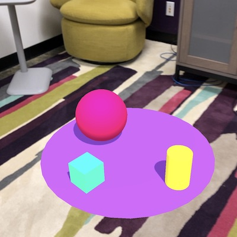

# 8th Wall with A-FRAME template

8th WallのA-FRAMEを使用したテンプレートファイルの作り方

文献（8th wall公式）：
https://github.com/i-am-ethan/8thwall-template.git
# 手順

## 1. APP KEYを取得する
8th wallのワークスペースから新規アプリを作成してAPP KEYを取得する。

## 2. APP KEYを反映する
index.htmlにAPP KEYを入力する。
```
<script async src="//apps.8thwall.com/xrweb?appKey=xxxxxxxx"></script>
```

## 3. serveディレクトリ直下でnpm install
```
npm install
```

## 4. デバイス認証
ワークスペースでデバイス認証を行う。

## 5. rootディレクトリでサーバー起動コマンド
```
./serve/bin/serve -d ./ 
```

## 6. 以下のようなものが出れば完了

